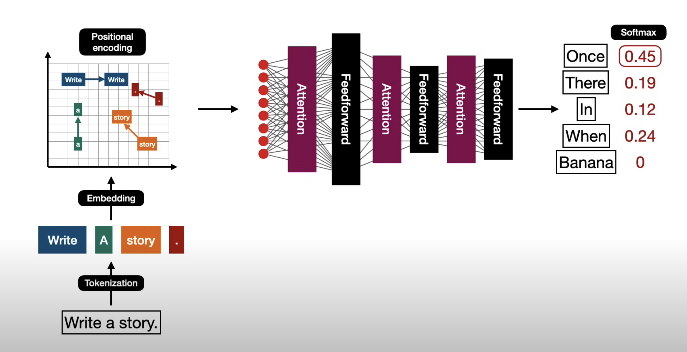
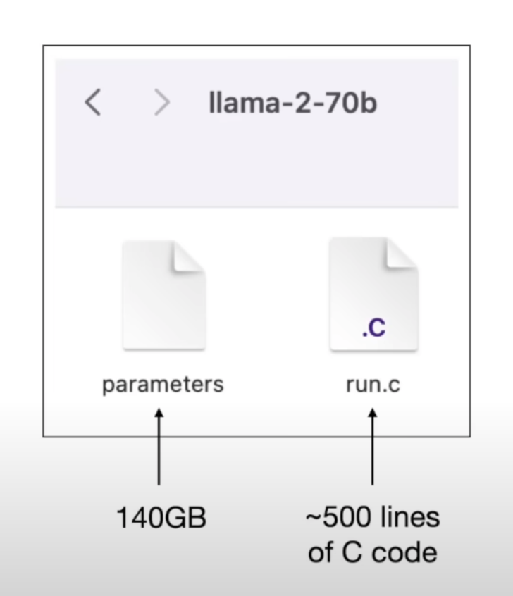
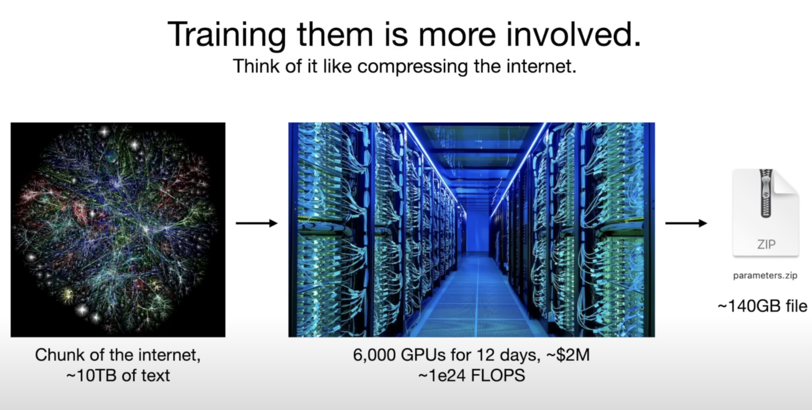

# Neverland/ML/images 文件夹图片解释

## transformer-architecture.png

这张图片展示了原始Transformer模型的完整架构。Transformer是一种基于自注意力机制的神经网络架构，由Google在2017年的论文《Attention Is All You Need》中提出。图中展示了编码器-解码器结构，包括多头自注意力机制、前馈神经网络、残差连接和层归一化等关键组件。这种架构已成为现代自然语言处理的基础。

## GPT-like decoder-only transformer architecture.png

这张图片展示了类似GPT（Generative Pre-trained Transformer）的仅解码器Transformer架构。与原始Transformer不同，GPT模型只使用解码器部分，并通过自回归方式生成文本。图中可能展示了如何通过掩码自注意力机制使模型只能看到序列中的前面部分，这是GPT等自回归语言模型的核心特性。

## decode-only-transformer.png

这张图片详细展示了仅解码器Transformer的内部结构。仅解码器模型（如GPT系列）与完整的编码器-解码器模型相比，只保留了解码器部分，并对其进行了适当修改以适应生成任务。图中可能展示了解码器堆叠的层结构、掩码自注意力机制以及如何处理输入和生成输出的流程。

## model-is-a-file.png

这张图片说明了深度学习模型本质上是以文件形式存储的概念。训练好的模型通常被保存为包含权重和结构信息的文件，可以被加载到内存中进行推理或继续训练。这种文件化的特性使得模型可以轻松分享、部署和版本控制，是现代机器学习工作流程的重要部分。

## pretrain-is-expensive.png

这张图片强调了预训练大型语言模型的高昂成本。预训练通常需要大量的计算资源（如GPU/TPU集群）和电力，处理海量的文本数据，可能持续数周甚至数月。图中可能展示了预训练过程中的资源消耗或成本估算，说明为什么大型语言模型的预训练通常只由大型科技公司或研究机构进行，而大多数研究者和开发者则使用已预训练的模型进行微调。